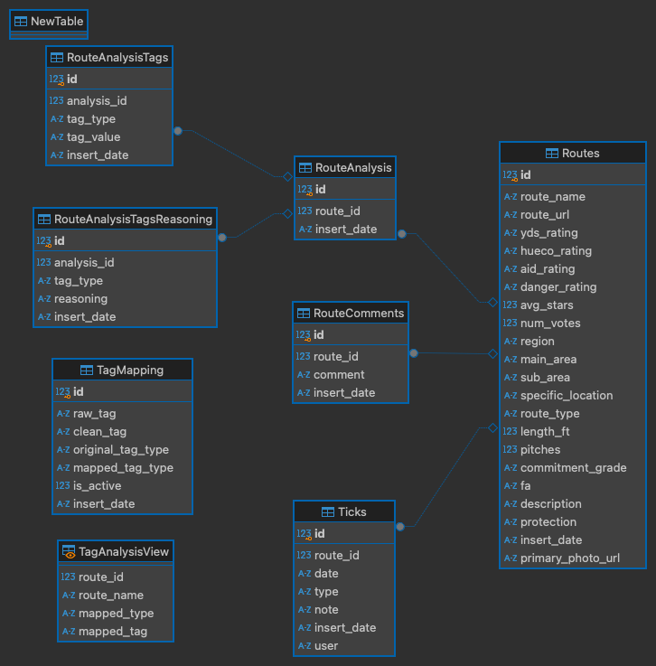

# Mountain Project Racked

A Spotify Wrapped-style visualization app for your Mountain Project climbing data. Look back at your stats, trends, and highlights from the year in an interactive format.

## Architecture

The application is built using a serverless architecture on AWS:

1. **Frontend**: Streamlit web application
2. **Backend Services**:
   - AWS Lambda functions for data processing
   - SQS queues for job management and retrying failed jobs
   - PostgreSQL database hosted on Neon for data storage

### Data Flow

1. User enters their Mountain Project Profile.
2. System checks if user data exists in database.
3. If new user or stale data:
   - Message is sent to SQS queue to initiate a scrape.
   - Orchestrator Lambda splits scraping into batches. Each page in a user's ticklist is a batch.
   - Worker Lambdas scrape and process Mountain Project pages in parallel.
   - New routes are analyzed and classified by AI and stored in database.
   - Streamlit app polls SQS for job completion. When scrape is finished app for user is generated and served.

## Technical Stack

- **Frontend**: 
  - Streamlit
  - Plotly
  - CSS & HTML for styling
- **Backend**: 
  - Python
  - AWS Lambda
  - AWS SQS
  - PostgreSQL
  - Playwright and BeautifulSoup for web scraping

## Deployment

The project uses GitHub Actions for CI/CD. The workflow:
1. Builds Lambda functions
2. Creates/updates SQS queues
3. Deploys Lambda functions
4. Configures DLQ for error handling

## Data Model

Below is the database schema showing relationships between Routes, Ticks, and AI Analysis:

## Live App

Try out Mountain Project Racked here: [MP Racked App](https://adamredfield-mp-scrape-srcstreamlitmp-racked-gnq4uz.streamlit.app/)

### How to Use
1. Visit the app link above
2. Enter your Mountain Project profile URL or User ID
   - Example URL: `https://www.mountainproject.com/user/200362278/doctor-choss` (this is my profile and can be used as a demo)
   - Example ID: `200362278/doctor-choss`
3. If your data hasn't been collected before, the app will scrape and process your climbing history
   - Initial data collection can take up to 15 minutes depending on how many routes you've climbed
   - Once complete, your personalized climbing analysis will be displayed
